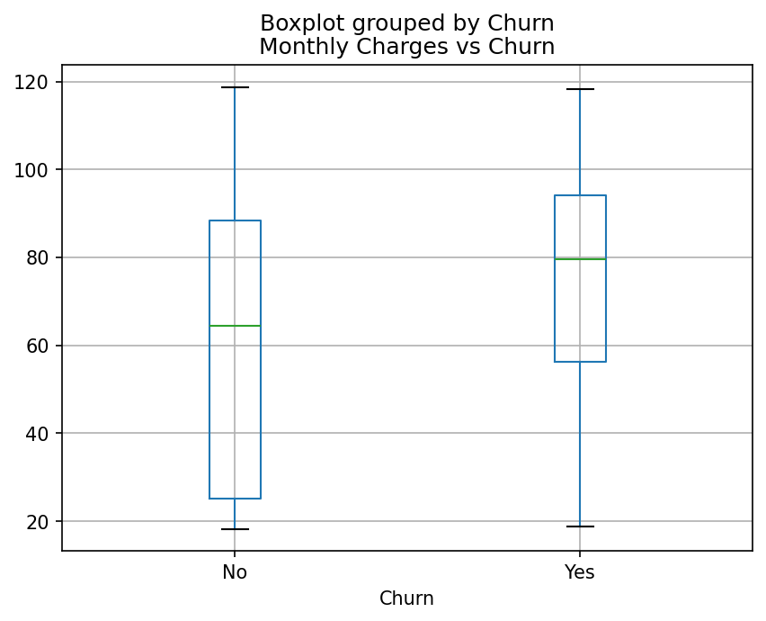

# Telco Customer Churn Analysis (Python)

## 📌 Project Overview
Customer churn is a critical business challenge in the telecommunications industry. This project analyzes the **Telco Customer Churn dataset** (~7,000 records) to identify factors that drive customer churn and to provide actionable business insights.  

The analysis was conducted in Python (pandas, seaborn, matplotlib) with a focus on **exploratory data analysis (EDA)**, **visual storytelling**, and **business recommendations** — the key skills of a data analyst.

---

## 🎯 Objectives
- Clean and prepare the dataset for analysis.  
- Explore patterns of churn across demographics, services, contracts, and charges.  
- Visualize churn rates across key drivers.  
- Summarize insights in a business-friendly format.  

---

## 📊 Executive Summary
- **Overall churn rate**: ~26% (≈1 in 4 customers).  
- **Contract type is the strongest driver**:  
  - Month-to-month churn ≈ 43%  
  - One-year churn ≈ 11%  
  - Two-year churn ≈ 3%  
- **Payment method matters**:  
  - Electronic check customers churn ≈ 45%  
  - Other methods: 15–20%  
- **Support services reduce churn**:  
  - No Tech Support/Online Security → ~30% churn  
  - With services → ~15% churn  
- **Tenure and charges**:  
  - Newer customers churn far more (especially <12 months).  
  - Higher monthly charges are linked to higher churn.  
- **Demographics**:  
  - Customers with dependents/partners churn less.  
  - Senior Citizens churn slightly more.  
  - Gender has no effect.  

**Recommendations**:  
1. Incentivize month-to-month customers to move to longer-term contracts.  
2. Encourage electronic check users to switch to auto-payment methods.  
3. Promote Tech Support and Online Security bundles to reduce churn.  
4. Focus on early-life retention strategies within the first year of tenure.  

---

## 🛠️ Tools & Technologies
- **Python**: pandas, seaborn, matplotlib  
- **Jupyter Notebook**: data cleaning, EDA, visualization  
- *(Optional)* Tableau / Power BI: for building interactive dashboards  

---

## 📈 Key Visuals

### Churn Rate by Contract Type
  

### Churn Rate by Payment Method
  

### Churn Rate by Tech Support
  

### Tenure Distribution by Churn
  

---

## 📥 Dataset
Dataset source: [Telco Customer Churn (Kaggle)](https://www.kaggle.com/blastchar/telco-customer-churn)  

---

## 📌 Next Steps
- Extend the project with an interactive **Tableau/Power BI dashboard**.  
- Automate churn KPI reporting using Python.  
- Explore simple predictive modeling as a comparison (optional).  
